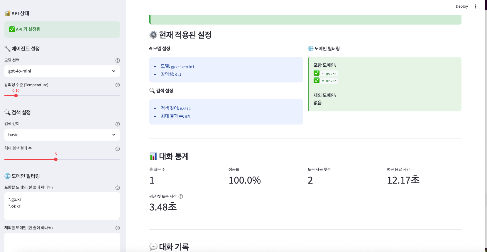
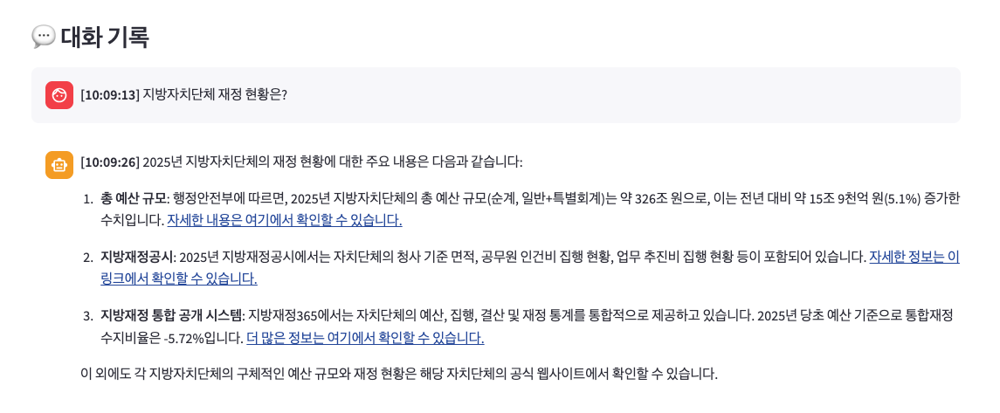

# PAI Web Agent

공공기관 정보 검색 전문 AI 에이전트

## 목표

대한민국 정부기관 및 공공기관의 최신 정보를 실시간으로 검색하고 정확한 답변을 제공합니다.

- 정부기관 사이트 (*.go.kr) 우선 검색
- 공공기관 사이트 (*.or.kr) 우선 검색
- OpenAI GPT + Tavily 검색 엔진 활용
- LangGraph 기반 React 패턴 적용

## 주요 기능

### 1. 실시간 웹 검색
- Tavily API를 통한 최신 정보 검색
- 도메인 필터링 (포함/제외)
- 검색 깊이 조절 (basic/advanced)

### 2. 설정 모니터링
- 실시간 설정 상태 표시
- 설정 변경 감지 및 알림
- 검색 실행 시 설정 정보 표시

### 3. 스트리밍 응답
- 실시간 토큰 스트리밍
- 처리 과정 시각화
- 대화 통계 제공

## 설치 및 실행

### 1. 의존성 설치

```bash
# uv 설치
curl -LsSf https://astral.sh/uv/install.sh | sh

# 프로젝트 의존성 설치
uv sync
```

### 2. API 키 설정

`.env` 파일 생성:

```env
OPENAI_API_KEY=your_openai_api_key_here
TAVILY_API_KEY=your_tavily_api_key_here
```

API 키 발급:
- OpenAI: https://platform.openai.com/api-keys
- Tavily: https://tavily.com (월 1,000회 무료)

### 3. 실행

```bash
# Streamlit 웹 인터페이스 (권장)
uv run streamlit run app.py

# 커맨드라인 실행
uv run python agent.py
```

## 모델 설정

### OpenAI 모델
- `gpt-4o-mini`: 빠르고 경제적 (권장)
- `gpt-4o`: 높은 정확도, 높은 비용
- `gpt-3.5-turbo`: 가장 빠름, 낮은 성능

### Temperature (창의성)
- `0.0 - 0.3`: 일관되고 사실적 (공공정보 검색 권장)
- `0.4 - 0.7`: 균형잡힌 응답
- `0.8 - 1.0`: 창의적이지만 일관성 낮음

### 검색 설정
- **검색 깊이**
  - `basic`: 빠른 검색 (무료 1,000회/월)
  - `advanced`: 정확한 검색 (비용 2배)
  
- **최대 결과 수**: 1-10개 (권장: 5개)

### 도메인 필터링
- **포함 도메인**: `*.go.kr`, `*.or.kr`
- **제외 도메인**: `*blog*`, `*tistory.com`


## 스크린샷

### 데모

