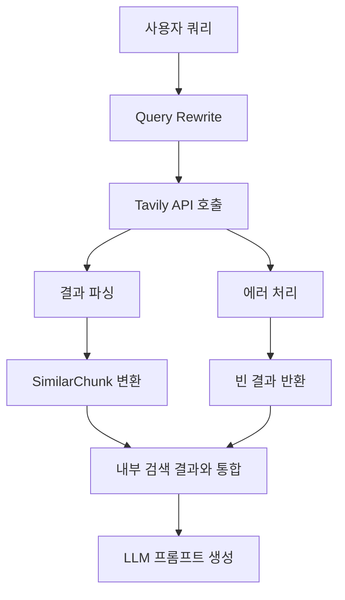

# Tavily Search 동작 로직 구현 가이드

## 목차
1. [개요](#1-개요)
2. [아키텍처 구조](#2-아키텍처-구조)
3. [상세 구현 가이드](#3-상세-구현-가이드)
4. [고급 기능 구현](#4-고급-기능-구현)
5. [모니터링 및 로깅](#5-모니터링-및-로깅)
6. [테스트 구현](#6-테스트-구현)
7. [배포 및 운영 가이드](#7-배포-및-운영-가이드)
8. [트러블슈팅](#8-트러블슈팅)

---

## 1. 개요

### 1.1 Tavily Search란?
Tavily Search는 RAG(Retrieval-Augmented Generation) 시스템에서 외부 웹 검색을 통해 실시간 정보를 제공하는 핵심 컴포넌트입니다. 내부 벡터 데이터베이스 검색과 함께 사용되어 더 풍부하고 최신의 정보를 제공합니다.

### 1.2 주요 특징
- **실시간 웹 검색**: 최신 정보 제공
- **비동기 처리**: 높은 성능과 확장성
- **결과 통합**: 내부 검색 결과와 seamless 통합
- **품질 관리**: 검색 결과 필터링 및 랭킹
- **에러 핸들링**: 안정적인 서비스 운영

### 1.3 시스템 내 역할
```
사용자 쿼리 → Query Rewrite → [내부 벡터 DB 검색 + Tavily 웹 검색] → 결과 통합 → LLM 응답 생성
```

---

## 2. 아키텍처 구조

### 2.1 핵심 컴포넌트
```
TavilySearchManager
├── AsyncTavilyClient (외부 라이브러리)
├── TavilySettings (설정 관리)
├── parse_tavily_results (결과 파싱)
├── Exception Handling (예외 처리)
└── Caching System (캐싱, 선택사항)
```

### 2.2 데이터 흐름도


### 2.3 도메인 모델 관계
```python
SimilarChunk
├── chunk: Chunk
│   ├── chunk_id: str
│   ├── section: str
│   ├── country_name: str
│   ├── prefix_content: str (제목)
│   ├── chunk_content: str (본문)
│   ├── embedded_text: str
│   └── from_url: str
├── retriever_score: float
├── bm25_score: float (선택사항)
└── cosine_score: float (선택사항)
```

---

## 3. 상세 구현 가이드

### 3.1 설정 클래스 구현

#### 3.1.1 기본 설정 클래스
```python
# src/settings.py
from pydantic import Field
from pydantic_settings import BaseSettings

class TavilySettings(BaseSettings):
    """
    Tavily API 설정 관리 클래스
    
    환경변수나 .env 파일에서 설정값을 자동으로 로드
    Kubernetes 환경에서는 Secret으로 관리 권장
    """
    tavily_api_key: str = Field(
        default="", 
        description="Tavily API 키",
        env="TAVILY_API_KEY"
    )
    
    # 검색 관련 설정
    max_results: int = Field(default=5, description="최대 검색 결과 수")
    search_depth: str = Field(default="advanced", description="검색 깊이 (basic/advanced)")
    timeout: int = Field(default=30, description="API 호출 타임아웃(초)")
    
    # 캐싱 설정
    enable_cache: bool = Field(default=True, description="캐싱 활성화 여부")
    cache_ttl: int = Field(default=3600, description="캐시 TTL(초)")
    
    class Config:
        env_file = ".env"
        env_prefix = "TAVILY_"
```

#### 3.1.2 환경별 설정 예시
```bash
# .env.development
TAVILY_API_KEY=your_development_api_key
TAVILY_MAX_RESULTS=3
TAVILY_SEARCH_DEPTH=basic
TAVILY_TIMEOUT=15

# .env.production
TAVILY_API_KEY=your_production_api_key
TAVILY_MAX_RESULTS=5
TAVILY_SEARCH_DEPTH=advanced
TAVILY_TIMEOUT=30
```

### 3.2 예외 처리 시스템

#### 3.2.1 예외 클래스 정의
```python
# src/exceptions.py
class MutuGptException(Exception):
    """기본 예외 클래스"""
    def __init__(self, message: str):
        self.message = message
        super().__init__(message)

class TavilySearchException(MutuGptException):
    """Tavily Search 전용 예외 클래스"""
    pass

class TavilyAPIException(TavilySearchException):
    """Tavily API 호출 실패 예외"""
    pass

class TavilyParsingException(TavilySearchException):
    """Tavily 결과 파싱 실패 예외"""
    pass

class TavilyTimeoutException(TavilySearchException):
    """Tavily API 타임아웃 예외"""
    pass

class TavilyQuotaException(TavilySearchException):
    """Tavily API 할당량 초과 예외"""
    pass
```

#### 3.2.2 예외 처리 전략
```python
# 예외 처리 우선순위
1. TavilyTimeoutException → 빈 결과 반환, 내부 검색 계속
2. TavilyQuotaException → 알림 발송, 내부 검색만 사용
3. TavilyAPIException → 로깅 후 빈 결과 반환
4. TavilyParsingException → 원본 응답 로깅, 빈 결과 반환
5. 기타 Exception → 일반적인 에러 처리
```

### 3.3 TavilySearchManager 핵심 구현

#### 3.3.1 기본 클래스 구조
```python
# src/tavily/manager.py
import asyncio
import hashlib
from datetime import datetime
from typing import Dict, List, Optional
from tavily import AsyncTavilyClient

from src.domain import Chunk, SimilarChunk
from src.exceptions import (
    TavilySearchException, 
    TavilyAPIException, 
    TavilyParsingException,
    TavilyTimeoutException
)
from src.settings import TavilySettings
from webapp.logger import event_logger

class TavilySearchManager:
    """
    Tavily Search API를 관리하는 핵심 클래스
    
    주요 기능:
    1. 비동기 웹 검색 수행
    2. 검색 결과를 내부 도메인 모델로 변환
    3. 에러 처리 및 로깅
    4. 클라이언트 연결 관리
    5. 결과 캐싱 (선택사항)
    """
    
    def __init__(self):
        self._client: Optional[AsyncTavilyClient] = None
        self._settings = TavilySettings()
        self._cache: Dict[str, Dict] = {}
        
    def _get_client(self) -> AsyncTavilyClient:
        """
        Lazy Loading 방식으로 Tavily 클라이언트 생성
        
        장점:
        - 메모리 효율성
        - API 키 검증 지연
        - 싱글톤 패턴으로 클라이언트 재사용
        """
        if self._client is None:
            if not self._settings.tavily_api_key:
                raise TavilyAPIException("Tavily API 키가 설정되지 않았습니다.")
            
            self._client = AsyncTavilyClient(
                api_key=self._settings.tavily_api_key
            )
            event_logger.info("Tavily 클라이언트 초기화 완료")
            
        return self._client
```

#### 3.3.2 결과 파싱 메서드
```python
def parse_tavily_results(self, search_result: Dict) -> List[SimilarChunk]:
    """
    Tavily API 응답을 내부 도메인 모델로 변환
    
    Args:
        search_result: Tavily API 응답 딕셔너리
        
    Returns:
        List[SimilarChunk]: 변환된 검색 결과 리스트
        
    Raises:
        TavilyParsingException: 파싱 실패시
    """
    try:
        # 응답 형식 검증
        if not isinstance(search_result, dict):
            raise TavilyParsingException("응답이 딕셔너리 형식이 아닙니다.")
        
        if "results" not in search_result:
            event_logger.warning("Tavily 응답에 'results' 키가 없습니다.")
            return []
        
        results = search_result["results"]
        if not isinstance(results, list):
            raise TavilyParsingException("'results'가 리스트 형식이 아닙니다.")
        
        similar_chunks = []
        
        for idx, item in enumerate(results):
            if not isinstance(item, dict):
                event_logger.warning(f"검색 결과 항목 {idx}가 딕셔너리가 아닙니다.")
                continue
            
            try:
                # 필수 필드 추출
                title = item.get("title", "").strip()
                content = item.get("content", "").strip()
                url = item.get("url", "").strip()
                
                # 최소 품질 기준 체크
                if not content or len(content) < 20:
                    event_logger.debug(f"내용이 너무 짧은 결과 스킵: {idx}")
                    continue
                
                if not url:
                    event_logger.debug(f"URL이 없는 결과 스킵: {idx}")
                    continue
                
                # 고유 ID 생성
                chunk_id = self._generate_chunk_id(url, idx)
                
                # Chunk 도메인 모델 생성
                chunk = Chunk(
                    chunk_id=chunk_id,
                    section="external_search",
                    country_name="",  # Tavily는 국가 정보 제공하지 않음
                    prefix_content=title,
                    chunk_content=content,
                    from_url=url,
                    embedded_text=f"{title} {content}"[:500],  # 임베딩용 텍스트 제한
                )
                
                # SimilarChunk로 래핑
                similar_chunk = SimilarChunk(
                    chunk=chunk,
                    retriever_score=1.0,  # 기본 점수 (후에 품질 평가로 조정)
                    bm25_score=None,
                    cosine_score=None
                )
                
                similar_chunks.append(similar_chunk)
                
            except Exception as e:
                event_logger.error(f"검색 결과 항목 {idx} 파싱 실패: {str(e)}")
                continue
        
        event_logger.info(
            f"Tavily 결과 파싱 완료: {len(results)}개 중 {len(similar_chunks)}개 변환 성공"
        )
        
        return similar_chunks
        
    except Exception as e:
        error_msg = f"Tavily 결과 파싱 실패: {str(e)}"
        event_logger.error(error_msg)
        raise TavilyParsingException(error_msg)

def _generate_chunk_id(self, url: str, index: int) -> str:
    """검색 결과용 고유 ID 생성"""
    url_hash = hashlib.md5(url.encode()).hexdigest()[:8]
    timestamp = int(datetime.now().timestamp())
    return f"tavily_{timestamp}_{url_hash}_{index}"
```

#### 3.3.3 비동기 검색 메서드
```python
async def search_async(self, query: str) -> List[SimilarChunk]:
    """
    비동기 웹 검색 수행
    
    Args:
        query: 검색 쿼리 문자열
        
    Returns:
        List[SimilarChunk]: 검색 결과 리스트
        
    Raises:
        TavilySearchException: 검색 실패시
    """
    # 입력 검증
    if not query or not query.strip():
        event_logger.warning("빈 검색 쿼리가 제공되었습니다.")
        return []
    
    query = query.strip()
    
    # 캐시 확인
    if self._settings.enable_cache:
        cached_result = self._get_from_cache(query)
        if cached_result is not None:
            event_logger.info(f"캐시에서 결과 반환: '{query}'")
            return cached_result
    
    try:
        client = self._get_client()
        
        # API 호출 파라미터 설정
        search_params = {
            "query": query,
            "search_depth": self._settings.search_depth,
            "max_results": self._settings.max_results,
            "include_answer": True,
            "include_raw_content": False,  # 성능 최적화
            "include_images": False,
        }
        
        event_logger.info(f"Tavily 검색 시작: '{query}' (depth: {self._settings.search_depth})")
        
        # 타임아웃과 함께 API 호출
        search_results = await asyncio.wait_for(
            client.search(**search_params),
            timeout=self._settings.timeout
        )
        
        # 결과 파싱
        results = self.parse_tavily_results(search_results)
        
        # 결과 품질 향상
        enhanced_results = self._enhance_results(results, query)
        
        # 캐시 저장
        if self._settings.enable_cache and enhanced_results:
            self._save_to_cache(query, enhanced_results)
        
        event_logger.info(
            f"Tavily 검색 완료: '{query}' → {len(enhanced_results)}개 결과"
        )
        
        return enhanced_results
        
    except asyncio.TimeoutError:
        error_msg = f"Tavily API 호출 타임아웃 (쿼리: '{query}', 제한시간: {self._settings.timeout}초)"
        event_logger.error(error_msg)
        raise TavilyTimeoutException(error_msg)
        
    except Exception as e:
        error_msg = f"Tavily 검색 실패 (쿼리: '{query}'): {str(e)}"
        event_logger.error(error_msg)
        
        # 특정 에러 타입 분류
        if "quota" in str(e).lower() or "limit" in str(e).lower():
            raise TavilyQuotaException(f"API 할당량 초과: {str(e)}")
        elif "api" in str(e).lower() or "key" in str(e).lower():
            raise TavilyAPIException(f"API 인증 오류: {str(e)}")
        else:
            raise TavilySearchException(error_msg)
```

#### 3.3.4 캐싱 시스템
```python
def _get_cache_key(self, query: str) -> str:
    """캐시 키 생성"""
    normalized_query = query.lower().strip()
    return hashlib.md5(normalized_query.encode()).hexdigest()

def _get_from_cache(self, query: str) -> Optional[List[SimilarChunk]]:
    """캐시에서 결과 조회"""
    cache_key = self._get_cache_key(query)
    
    if cache_key in self._cache:
        cache_data = self._cache[cache_key]
        
        # TTL 체크
        if datetime.now().timestamp() - cache_data["timestamp"] < self._settings.cache_ttl:
            return cache_data["results"]
        else:
            # 만료된 캐시 삭제
            del self._cache[cache_key]
            event_logger.debug(f"만료된 캐시 삭제: {query}")
    
    return None

def _save_to_cache(self, query: str, results: List[SimilarChunk]) -> None:
    """캐시에 결과 저장"""
    cache_key = self._get_cache_key(query)
    self._cache[cache_key] = {
        "results": results,
        "timestamp": datetime.now().timestamp()
    }
    
    # 캐시 크기 제한 (메모리 관리)
    if len(self._cache) > 1000:
        # 가장 오래된 항목 삭제
        oldest_key = min(self._cache.keys(), key=lambda k: self._cache[k]["timestamp"])
        del self._cache[oldest_key]
        event_logger.debug("캐시 크기 제한으로 오래된 항목 삭제")
```

### 3.4 ChatManager 통합

#### 3.4.1 ChatManager에서의 사용
```python
# src/executor/chat_manager.py (관련 부분)
class ChatManager:
    def __init__(self, tavily_search_manager: TavilySearchManager, ...):
        self.tavily_search_manager = tavily_search_manager
        # ... 기타 매니저들
    
    async def handle_chat_query(self, chat_query: ChatQuery) -> AsyncGenerator[str, None]:
        # ... 기존 로직 (Step 1-5)
        
        # Step 5.5: Tavily Search 수행
        tavily_search_results = []
        
        # 가드레일 체크 - Illegal인 경우 외부 검색도 스킵
        if query_agent_result_domain.guardrail != "Illegal":
            try:
                tavily_start_time = time.time()
                
                tavily_search_results = await self.tavily_search_manager.search_async(
                    chat_query.rewritten_query
                )
                
                tavily_end_time = time.time()
                event_logger.info(
                    f"Tavily 검색 완료 - "
                    f"소요시간: {tavily_end_time - tavily_start_time:.2f}s, "
                    f"결과: {len(tavily_search_results)}개"
                )
                
            except TavilyTimeoutException as e:
                event_logger.warning(f"Tavily 검색 타임아웃: {e.message}")
                tavily_search_results = []
                
            except TavilyQuotaException as e:
                event_logger.error(f"Tavily API 할당량 초과: {e.message}")
                # 알림 시스템에 전송 (선택사항)
                tavily_search_results = []
                
            except TavilySearchException as e:
                event_logger.error(f"Tavily 검색 실패: {e.message}")
                tavily_search_results = []
                
        else:
            event_logger.info("가드레일 Illegal - Tavily 검색 스킵")
        
        # ... 내부 검색 로직 (Step 6-8.5)
        
        # Step 9: 검색 결과 통합
        combined_search_results = list(chain(retriever_results, tavily_search_results))
        
        # 통합 결과 로깅
        event_logger.info(
            f"검색 결과 통합 완료 - "
            f"총 {len(combined_search_results)}건 "
            f"(내부: {len(retriever_results)}, 외부: {len(tavily_search_results)})"
        )
        
        # ... 나머지 로직
```

---

## 4. 고급 기능 구현

### 4.1 결과 품질 향상

#### 4.1.1 중복 제거 및 필터링
```python
def _enhance_results(self, results: List[SimilarChunk], original_query: str) -> List[SimilarChunk]:
    """
    Tavily 검색 결과의 품질을 향상시키는 후처리
    
    1. 중복 URL 제거
    2. 콘텐츠 길이 필터링
    3. 관련성 점수 계산
    4. 품질 기준 적용
    """
    if not results:
        return results
    
    enhanced_results = []
    seen_urls = set()
    seen_content_hashes = set()
    
    for chunk in results:
        # 중복 URL 체크
        if chunk.chunk.from_url in seen_urls:
            event_logger.debug(f"중복 URL 제외: {chunk.chunk.from_url}")
            continue
        seen_urls.add(chunk.chunk.from_url)
        
        # 중복 콘텐츠 체크 (해시 기반)
        content_hash = hashlib.md5(chunk.chunk.chunk_content.encode()).hexdigest()
        if content_hash in seen_content_hashes:
            event_logger.debug("중복 콘텐츠 제외")
            continue
        seen_content_hashes.add(content_hash)
        
        # 콘텐츠 길이 체크
        content_length = len(chunk.chunk.chunk_content.strip())
        if content_length < 50:
            event_logger.debug(f"콘텐츠가 너무 짧음: {content_length}자")
            continue
        
        if content_length > 5000:
            # 너무 긴 콘텐츠는 잘라내기
            chunk.chunk.chunk_content = chunk.chunk.chunk_content[:5000] + "..."
            event_logger.debug("콘텐츠 길이 제한 적용")
        
        # 관련성 점수 계산
        relevance_score = self._calculate_relevance_score(original_query, chunk)
        
        # 최소 관련성 기준 체크
        if relevance_score < 0.1:
            event_logger.debug(f"관련성이 낮음: {relevance_score:.3f}")
            continue
        
        # 점수 업데이트
        chunk.retriever_score = relevance_score
        enhanced_results.append(chunk)
    
    # 관련성 점수로 정렬
    enhanced_results.sort(key=lambda x: x.retriever_score, reverse=True)
    
    event_logger.info(
        f"결과 품질 향상 완료: {len(results)} → {len(enhanced_results)}개"
    )
    
    return enhanced_results

def _calculate_relevance_score(self, query: str, chunk: SimilarChunk) -> float:
    """
    쿼리와 검색 결과 간의 관련성 점수 계산
    
    여러 지표를 종합하여 0.0 ~ 1.0 사이의 점수 반환
    """
    query_words = set(query.lower().split())
    title_words = set(chunk.chunk.prefix_content.lower().split())
    content_words = set(chunk.chunk.chunk_content.lower().split())
    
    if not query_words:
        return 0.0
    
    # 1. 제목 매칭 점수 (가중치 높음)
    title_intersection = len(query_words.intersection(title_words))
    title_score = title_intersection / len(query_words) if query_words else 0.0
    
    # 2. 콘텐츠 매칭 점수
    content_intersection = len(query_words.intersection(content_words))
    content_score = content_intersection / len(query_words) if query_words else 0.0
    
    # 3. 자카드 유사도 (전체)
    all_words = title_words.union(content_words)
    jaccard_score = len(query_words.intersection(all_words)) / len(query_words.union(all_words))
    
    # 4. 콘텐츠 품질 점수 (길이 기반)
    content_length = len(chunk.chunk.chunk_content)
    length_score = min(content_length / 1000, 1.0)  # 1000자 기준으로 정규화
    
    # 가중 평균 계산
    final_score = (
        title_score * 0.4 +      # 제목 매칭 40%
        content_score * 0.3 +    # 콘텐츠 매칭 30%
        jaccard_score * 0.2 +    # 전체 유사도 20%
        length_score * 0.1       # 콘텐츠 품질 10%
    )
    
    return min(final_score, 1.0)
```

### 4.2 배치 검색 기능

#### 4.2.1 동시 검색 처리
```python
async def search_batch_async(
    self, 
    queries: List[str], 
    max_concurrent: int = 3
) -> Dict[str, List[SimilarChunk]]:
    """
    여러 쿼리를 동시에 검색
    
    Args:
        queries: 검색할 쿼리 리스트
        max_concurrent: 최대 동시 실행 수
        
    Returns:
        Dict[str, List[SimilarChunk]]: 쿼리별 검색 결과
    """
    if not queries:
        return {}
    
    # 중복 쿼리 제거
    unique_queries = list(set(query.strip() for query in queries if query.strip()))
    
    if not unique_queries:
        return {}
    
    event_logger.info(f"배치 검색 시작: {len(unique_queries)}개 쿼리")
    
    # 세마포어로 동시 실행 수 제한
    semaphore = asyncio.Semaphore(max_concurrent)
    
    async def search_with_semaphore(query: str) -> tuple[str, List[SimilarChunk]]:
        async with semaphore:
            try:
                results = await self.search_async(query)
                return query, results
            except Exception as e:
                event_logger.error(f"배치 검색 중 오류 (쿼리: '{query}'): {str(e)}")
                return query, []
    
    # 모든 검색 작업을 동시에 실행
    tasks = [search_with_semaphore(query) for query in unique_queries]
    results = await asyncio.gather(*tasks, return_exceptions=True)
    
    # 결과 정리
    search_results = {}
    successful_count = 0
    
    for result in results:
        if isinstance(result, Exception):
            event_logger.error(f"배치 검색 예외: {result}")
            continue
        
        query, search_result = result
        search_results[query] = search_result
        
        if search_result:
            successful_count += 1
    
    event_logger.info(
        f"배치 검색 완료: {len(unique_queries)}개 중 {successful_count}개 성공"
    )
    
    return search_results
```

### 4.3 스마트 쿼리 확장

#### 4.3.1 쿼리 확장 기능
```python
def _expand_query(self, original_query: str, ner_entities: List[str]) -> str:
    """
    NER 정보를 활용한 쿼리 확장
    
    Args:
        original_query: 원본 쿼리
        ner_entities: NER로 추출된 엔티티 리스트
        
    Returns:
        str: 확장된 쿼리
    """
    expanded_parts = [original_query]
    
    # 국가명이 있으면 추가
    for entity in ner_entities:
        if entity and entity not in original_query:
            expanded_parts.append(entity)
    
    # 확장된 쿼리 생성 (너무 길어지지 않도록 제한)
    expanded_query = " ".join(expanded_parts)
    
    if len(expanded_query) > 200:
        expanded_query = expanded_query[:200] + "..."
    
    if expanded_query != original_query:
        event_logger.info(f"쿼리 확장: '{original_query}' → '{expanded_query}'")
    
    return expanded_query

# ChatManager에서 사용 예시
async def handle_chat_query(self, chat_query: ChatQuery) -> AsyncGenerator[str, None]:
    # ... 기존 로직
    
    # 쿼리 확장
    expanded_query = self.tavily_search_manager._expand_query(
        chat_query.rewritten_query, 
        ner_entities
    )
    
    # 확장된 쿼리로 검색
    tavily_search_results = await self.tavily_search_manager.search_async(expanded_query)
```

---

## 5. 모니터링 및 로깅

### 5.1 성능 메트릭

#### 5.1.1 메트릭 클래스 정의
```python
# src/tavily/metrics.py
from dataclasses import dataclass, field
from typing import List
import time
from datetime import datetime, timedelta

@dataclass
class TavilyMetrics:
    """Tavily 검색 성능 메트릭"""
    # 기본 통계
    total_searches: int = 0
    successful_searches: int = 0
    failed_searches: int = 0
    cache_hits: int = 0
    cache_misses: int = 0
    
    # 성능 통계
    total_response_time: float = 0.0
    min_response_time: float = float('inf')
    max_response_time: float = 0.0
    response_times: List[float] = field(default_factory=list)
    
    # 에러 통계
    timeout_errors: int = 0
    api_errors: int = 0
    parsing_errors: int = 0
    quota_errors: int = 0
    
    # 품질 통계
    total_results_returned: int = 0
    average_results_per_query: float = 0.0
    
    @property
    def success_rate(self) -> float:
        """성공률 계산"""
        if self.total_searches == 0:
            return 0.0
        return self.successful_searches / self.total_searches
    
    @property
    def cache_hit_rate(self) -> float:
        """캐시 히트율 계산"""
        total_cache_requests = self.cache_hits + self.cache_misses
        if total_cache_requests == 0:
            return 0.0
        return self.cache_hits / total_cache_requests
    
    @property
    def average_response_time(self) -> float:
        """평균 응답 시간 계산"""
        if not self.response_times:
            return 0.0
        return sum(self.response_times) / len(self.response_times)
    
    def add_response_time(self, response_time: float):
        """응답 시간 추가 및 통계 업데이트"""
        self.response_times.append(response_time)
        self.total_response_time += response_time
        self.min_response_time = min(self.min_response_time, response_time)
        self.max_response_time = max(self.max_response_time, response_time)
        
        # 메모리 관리: 최근 1000개만 유지
        if len(self.response_times) > 1000:
            removed_time = self.response_times.pop(0)
            self.total_response_time -= removed_time
    
    def to_dict(self) -> dict:
        """메트릭을 딕셔너리로 변환"""
        return {
            "total_searches": self.total_searches,
            "successful_searches": self.successful_searches,
            "failed_searches": self.failed_searches,
            "success_rate": round(self.success_rate, 4),
            "cache_hits": self.cache_hits,
            "cache_misses": self.cache_misses,
            "cache_hit_rate": round(self.cache_hit_rate, 4),
            "average_response_time": round(self.average_response_time, 4),
            "min_response_time": round(self.min_response_time, 4) if self.min_response_time != float('inf') else 0,
            "max_response_time": round(self.max_response_time, 4),
            "timeout_errors": self.timeout_errors,
            "api_errors": self.api_errors,
            "parsing_errors": self.parsing_errors,
            "quota_errors": self.quota_errors,
            "total_results_returned": self.total_results_returned,
            "average_results_per_query": round(self.average_results_per_query, 2)
        }
```

#### 5.1.2 메트릭 수집 통합
```python
# TavilySearchManager에 메트릭 수집 추가
class TavilySearchManager:
    def __init__(self):
        # ... 기존 초기화
        self.metrics = TavilyMetrics()
    
    async def search_async(self, query: str) -> List[SimilarChunk]:
        start_time = time.time()
        self.metrics.total_searches += 1
        
        # 캐시 확인
        if self._settings.enable_cache:
            cached_result = self._get_from_cache(query)
            if cached_result is not None:
                self.metrics.cache_hits += 1
                return cached_result
            else:
                self.metrics.cache_misses += 1
        
        try:
            # ... 검색 로직
            results = await self._perform_search(query)
            
            # 성공 메트릭 업데이트
            self.metrics.successful_searches += 1
            self.metrics.total_results_returned += len(results)
            self.metrics.average_results_per_query = (
                self.metrics.total_results_returned / self.metrics.successful_searches
            )
            
            return results
            
        except TavilyTimeoutException:
            self.metrics.failed_searches += 1
            self.metrics.timeout_errors += 1
            raise
            
        except TavilyAPIException:
            self.metrics.failed_searches += 1
            self.metrics.api_errors += 1
            raise
            
        except TavilyParsingException:
            self.metrics.failed_searches += 1
            self.metrics.parsing_errors += 1
            raise
            
        except TavilyQuotaException:
            self.metrics.failed_searches += 1
            self.metrics.quota_errors += 1
            raise
            
        finally:
            # 응답 시간 기록
            response_time = time.time() - start_time
            self.metrics.add_response_time(response_time)
            
            # 상세 로깅
            event_logger.info(
                f"Tavily 검색 완료 - "
                f"쿼리: '{query}', "
                f"응답시간: {response_time:.2f}s, "
                f"성공률: {self.metrics.success_rate:.2%}, "
                f"캐시 히트율: {self.metrics.cache_hit_rate:.2%}"
            )
```

### 5.2 로깅 시스템

#### 5.2.1 구조화된 로깅
```python
# webapp/logger.py에 Tavily 전용 로거 추가
import logging
import json
from datetime import datetime

class TavilyLogger:
    """Tavily 검색 전용 로거"""
    
    def __init__(self):
        self.logger = logging.getLogger("tavily_search")
        self.logger.setLevel(logging.INFO)
        
        # 핸들러 설정
        if not self.logger.handlers:
            handler = logging.StreamHandler()
            formatter = logging.Formatter(
                '%(asctime)s - %(name)s - %(levelname)s - %(message)s'
            )
            handler.setFormatter(formatter)
            self.logger.addHandler(handler)
    
    def log_search_request(self, query: str, params: dict):
        """검색 요청 로깅"""
        log_data = {
            "event": "search_request",
            "query": query,
            "params": params,
            "timestamp": datetime.now().isoformat()
        }
        self.logger.info(json.dumps(log_data, ensure_ascii=False))
    
    def log_search_response(self, query: str, result_count: int, response_time: float):
        """검색 응답 로깅"""
        log_data = {
            "event": "search_response",
            "query": query,
            "result_count": result_count,
            "response_time": response_time,
            "timestamp": datetime.now().isoformat()
        }
        self.logger.info(json.dumps(log_data, ensure_ascii=False))
    
    def log_error(self, query: str, error_type: str, error_message: str):
        """에러 로깅"""
        log_data = {
            "event": "search_error",
            "query": query,
            "error_type": error_type,
            "error_message": error_message,
            "timestamp": datetime.now().isoformat()
        }
        self.logger.error(json.dumps(log_data, ensure_ascii=False))

# 전역 로거 인스턴스
tavily_logger = TavilyLogger()
```

---

## 6. 테스트 구현

### 6.1 단위 테스트

#### 6.1.1 기본 테스트 구조
```python
# tests/tavily/test_tavily_search_manager.py
import pytest
import asyncio
from unittest.mock import AsyncMock, patch, MagicMock
from src.tavily.manager import TavilySearchManager
from src.exceptions import (
    TavilySearchException, 
    TavilyAPIException, 
    TavilyParsingException,
    TavilyTimeoutException
)

class TestTavilySearchManager:
    
    @pytest.fixture
    def tavily_manager(self):
        """TavilySearchManager 인스턴스 생성"""
        return TavilySearchManager()
    
    @pytest.fixture
    def mock_tavily_response(self):
        """모의 Tavily API 응답"""
        return {
            "results": [
                {
                    "title": "테스트 제목 1",
                    "content": "이것은 테스트 내용입니다. 충분히 긴 내용을 포함하고 있습니다.",
                    "url": "https://example.com/1"
                },
                {
                    "title": "테스트 제목 2", 
                    "content": "두 번째 테스트 내용입니다. 이것도 충분히 긴 내용입니다.",
                    "url": "https://example.com/2"
                }
            ]
        }
    
    @pytest.fixture
    def mock_settings(self):
        """모의 설정"""
        settings = MagicMock()
        settings.tavily_api_key = "test_api_key"
        settings.max_results = 5
        settings.search_depth = "advanced"
        settings.timeout = 30
        settings.enable_cache = False
        return settings

    @pytest.mark.asyncio
    async def test_search_async_success(self, tavily_manager, mock_tavily_response, mock_settings):
        """정상적인 검색 테스트"""
        # 설정 모킹
        tavily_manager._settings = mock_settings
        
        # 클라이언트 모킹
        with patch.object(tavily_manager, '_get_client') as mock_get_client:
            mock_client = AsyncMock()
            mock_client.search.return_value = mock_tavily_response
            mock_get_client.return_value = mock_client
            
            # 검색 실행
            results = await tavily_manager.search_async("테스트 쿼리")
            
            # 검증
            assert len(results) == 2
            assert results[0].chunk.prefix_content == "테스트 제목 1"
            assert results[0].chunk.chunk_content == "이것은 테스트 내용입니다. 충분히 긴 내용을 포함하고 있습니다."
            assert results[0].chunk.from_url == "https://example.com/1"
            assert results[0].chunk.section == "external_search"
            
            # API 호출 검증
            mock_client.search.assert_called_once_with(
                query="테스트 쿼리",
                search_depth="advanced",
                max_results=5,
                include_answer=True,
                include_raw_content=False,
                include_images=False
            )
    
    @pytest.mark.asyncio
    async def test_search_async_empty_query(self, tavily_manager):
        """빈 쿼리 테스트"""
        results = await tavily_manager.search_async("")
        assert results == []
        
        results = await tavily_manager.search_async("   ")
        assert results == []
        
        results = await tavily_manager.search_async(None)
        assert results == []
    
    @pytest.mark.asyncio
    async def test_search_async_timeout(self, tavily_manager, mock_settings):
        """API 타임아웃 테스트"""
        tavily_manager._settings = mock_settings
        
        with patch.object(tavily_manager, '_get_client') as mock_get_client:
            mock_client = AsyncMock()
            mock_client.search.side_effect = asyncio.TimeoutError()
            mock_get_client.return_value = mock_client
            
            with pytest.raises(TavilyTimeoutException) as exc_info:
                await tavily_manager.search_async("테스트 쿼리")
            
            assert "타임아웃" in str(exc_info.value.message)
    
    @pytest.mark.asyncio
    async def test_search_async_api_error(self, tavily_manager, mock_settings):
        """API 오류 테스트"""
        tavily_manager._settings = mock_settings
        
        with patch.object(tavily_manager, '_get_client') as mock_get_client:
            mock_client = AsyncMock()
            mock_client.search.side_effect = Exception("API 키가 유효하지 않습니다")
            mock_get_client.return_value = mock_client
            
            with pytest.raises(TavilyAPIException) as exc_info:
                await tavily_manager.search_async("테스트 쿼리")
            
            assert "API 인증 오류" in str(exc_info.value.message)
    
    def test_parse_tavily_results_success(self, tavily_manager, mock_tavily_response):
        """결과 파싱 성공 테스트"""
        results = tavily_manager.parse_tavily_results(mock_tavily_response)
        
        assert len(results) == 2
        assert all(result.chunk.section == "external_search" for result in results)
        assert all(result.retriever_score == 1.0 for result in results)
    
    def test_parse_tavily_results_invalid_format(self, tavily_manager):
        """잘못된 형식 파싱 테스트"""
        # 딕셔너리가 아닌 경우
        with pytest.raises(TavilyParsingException):
            tavily_manager.parse_tavily_results("invalid")
        
        # results 키가 없는 경우
        results = tavily_manager.parse_tavily_results({"no_results": []})
        assert results == []
        
        # results가 리스트가 아닌 경우
        with pytest.raises(TavilyParsingException):
            tavily_manager.parse_tavily_results({"results": "not_a_list"})
    
    def test_parse_tavily_results_quality_filter(self, tavily_manager):
        """품질 필터링 테스트"""
        low_quality_response = {
            "results": [
                {
                    "title": "좋은 제목",
                    "content": "충분히 긴 내용입니다. 이 내용은 품질 기준을 통과할 것입니다.",
                    "url": "https://example.com/good"
                },
                {
                    "title": "짧은 제목",
                    "content": "짧음",  # 너무 짧은 내용
                    "url": "https://example.com/short"
                },
                {
                    "title": "URL 없음",
                    "content": "URL이 없는 내용입니다. 이것도 충분히 긴 내용입니다.",
                    "url": ""  # URL 없음
                }
            ]
        }
        
        results = tavily_manager.parse_tavily_results(low_quality_response)
        
        # 품질 기준을 통과한 결과만 남아야 함
        assert len(results) == 1
        assert results[0].chunk.prefix_content == "좋은 제목"
```

#### 6.1.2 통합 테스트
```python
# tests/tavily/test_tavily_integration.py
import pytest
from src.executor.chat_manager import ChatManager
from src.domain import ChatQuery

class TestTavilyIntegration:
    
    @pytest.mark.asyncio
    async def test_chat_manager_with_tavily(self, chat_manager_with_mocks):
        """ChatManager와 Tavily 통합 테스트"""
        chat_query = ChatQuery(
            session_id="test_session",
            user_message="한국의 무역 정책에 대해 알려주세요",
            query_turn_in_session=1,
            query_regeneration_step=0,
            llm_model="gpt-4",
            embedding_model="text-embedding-ada-002"
        )
        
        responses = []
        async for response in chat_manager_with_mocks.handle_chat_query(chat_query):
            responses.append(response)
        
        # 응답이 생성되었는지 확인
        assert len(responses) > 0
        
        # 마지막 응답에 Tavily 검색 결과가 포함되었는지 확인
        final_response = json.loads(responses[-1])
        assert final_response["status"] == "complete"
        assert "from_url_meta_list" in final_response
```

### 6.2 성능 테스트

#### 6.2.1 부하 테스트
```python
# tests/tavily/test_tavily_performance.py
import pytest
import asyncio
import time
from src.tavily.manager import TavilySearchManager

class TestTavilyPerformance:
    
    @pytest.mark.asyncio
    async def test_concurrent_searches(self):
        """동시 검색 성능 테스트"""
        manager = TavilySearchManager()
        
        # 10개의 동시 검색 실행
        queries = [f"테스트 쿼리 {i}" for i in range(10)]
        
        start_time = time.time()
        
        tasks = [manager.search_async(query) for query in queries]
        results = await asyncio.gather(*tasks, return_exceptions=True)
        
        end_time = time.time()
        
        # 성능 검증
        assert end_time - start_time < 60  # 1분 이내 완료
        
        # 결과 검증
        successful_results = [r for r in results if not isinstance(r, Exception)]
        assert len(successful_results) >= 5  # 최소 50% 성공률
    
    @pytest.mark.asyncio
    async def test_cache_performance(self):
        """캐시 성능 테스트"""
        manager = TavilySearchManager()
        manager._settings.enable_cache = True
        
        query = "캐시 테스트 쿼리"
        
        # 첫 번째 검색 (캐시 미스)
        start_time = time.time()
        await manager.search_async(query)
        first_time = time.time() - start_time
        
        # 두 번째 검색 (캐시 히트)
        start_time = time.time()
        await manager.search_async(query)
        second_time = time.time() - start_time
        
        # 캐시된 결과가 더 빨라야 함
        assert second_time < first_time * 0.1  # 10배 이상 빨라야 함
```

---

## 7. 배포 및 운영 가이드

### 7.1 환경 설정

#### 7.1.1 Kubernetes 설정
```yaml
# k8s/service/dev/sealedsecret/tavily-secret.yaml
apiVersion: bitnami.com/v1alpha1
kind: SealedSecret
metadata:
  name: tavily-secret
  namespace: default
spec:
  encryptedData:
    TAVILY_API_KEY: AgBy3i4OJSWK+PiTySYZZA9rO21HcMhxd...  # 암호화된 API 키
    TAVILY_MAX_RESULTS: AgAh7dMcQF...  # 암호화된 설정값들
    TAVILY_SEARCH_DEPTH: AgBx9kL...
    TAVILY_TIMEOUT: AgCm4nR...
  template:
    metadata:
      name: tavily-secret
      namespace: default
    type: Opaque
```

#### 7.1.2 애플리케이션 설정
```yaml
# k8s/service/dev/application/deployment.yaml
apiVersion: apps/v1
kind: Deployment
metadata:
  name: mutugpt-system
spec:
  template:
    spec:
      containers:
      - name: system
        image: mutugpt/system:latest
        env:
        - name: TAVILY_API_KEY
          valueFrom:
            secretKeyRef:
              name: tavily-secret
              key: TAVILY_API_KEY
        - name: TAVILY_MAX_RESULTS
          valueFrom:
            secretKeyRef:
              name: tavily-secret
              key: TAVILY_MAX_RESULTS
        - name: TAVILY_SEARCH_DEPTH
          valueFrom:
            secretKeyRef:
              name: tavily-secret
              key: TAVILY_SEARCH_DEPTH
        - name: TAVILY_TIMEOUT
          valueFrom:
            secretKeyRef:
              name: tavily-secret
              key: TAVILY_TIMEOUT
        # 리소스 제한
        resources:
          requests:
            memory: "512Mi"
            cpu: "250m"
          limits:
            memory: "1Gi"
            cpu: "500m"
```

### 7.2 모니터링 설정

#### 7.2.1 헬스체크 엔드포인트
```python
# webapp/routers/health.py
from fastapi import APIRouter, HTTPException
from src.tavily.manager import TavilySearchManager
from webapp.dependency import get_tavily_search_manager

router = APIRouter(prefix="/health", tags=["health"])

@router.get("/tavily")
async def tavily_health_check():
    """Tavily API 상태 확인"""
    try:
        manager = get_tavily_search_manager()
        
        # 간단한 테스트 검색으로 API 상태 확인
        test_results = await manager.search_async("health check")
        
        return {
            "status": "healthy",
            "api_accessible": True,
            "test_results_count": len(test_results),
            "metrics": manager.metrics.to_dict()
        }
        
    except Exception as e:
        return {
            "status": "unhealthy",
            "api_accessible": False,
            "error": str(e),
            "metrics": manager.metrics.to_dict() if 'manager' in locals() else {}
        }

@router.get("/tavily/metrics")
async def tavily_metrics():
    """Tavily 상세 메트릭 조회"""
    try:
        manager = get_tavily_search_manager()
        return {
            "status": "success",
            "metrics": manager.metrics.to_dict(),
            "cache_size": len(manager._cache) if hasattr(manager, '_cache') else 0
        }
    except Exception as e:
        raise HTTPException(status_code=500, detail=str(e))
```

#### 7.2.2 Prometheus 메트릭
```python
# webapp/metrics.py
from prometheus_client import Counter, Histogram, Gauge
import time

# Tavily 관련 메트릭 정의
tavily_requests_total = Counter(
    'tavily_requests_total',
    'Total number of Tavily API requests',
    ['status']  # success, error, timeout
)

tavily_request_duration = Histogram(
    'tavily_request_duration_seconds',
    'Time spent on Tavily API requests',
    buckets=[0.1, 0.5, 1.0, 2.0, 5.0, 10.0, 30.0]
)

tavily_cache_hits_total = Counter(
    'tavily_cache_hits_total',
    'Total number of Tavily cache hits'
)

tavily_results_returned = Histogram(
    'tavily_results_returned',
    'Number of results returned by Tavily',
    buckets=[0, 1, 2, 3, 4, 5, 10]
)

# TavilySearchManager에 메트릭 수집 추가
class TavilySearchManager:
    async def search_async(self, query: str) -> List[SimilarChunk]:
        start_time = time.time()
        
        try:
            # ... 검색 로직
            results = await self._perform_search(query)
            
            # 성공 메트릭
            tavily_requests_total.labels(status='success').inc()
            tavily_results_returned.observe(len(results))
            
            return results
            
        except TavilyTimeoutException:
            tavily_requests_total.labels(status='timeout').inc()
            raise
        except Exception:
            tavily_requests_total.labels(status='error').inc()
            raise
        finally:
            # 응답 시간 기록
            duration = time.time() - start_time
            tavily_request_duration.observe(duration)
```

### 7.3 로그 관리

#### 7.3.1 구조화된 로깅 설정
```python
# webapp/logger.py
import logging
import json
from datetime import datetime
from typing import Dict, Any

class TavilyStructuredLogger:
    """Tavily 전용 구조화된 로거"""
    
    def __init__(self):
        self.logger = logging.getLogger("tavily")
        self.logger.setLevel(logging.INFO)
        
        # JSON 포맷터 설정
        formatter = logging.Formatter(
            '%(asctime)s - %(name)s - %(levelname)s - %(message)s'
        )
        
        handler = logging.StreamHandler()
        handler.setFormatter(formatter)
        self.logger.addHandler(handler)
    
    def _log_structured(self, level: str, event: str, data: Dict[str, Any]):
        """구조화된 로그 출력"""
        log_entry = {
            "timestamp": datetime.now().isoformat(),
            "service": "tavily_search",
            "event": event,
            "level": level,
            **data
        }
        
        log_message = json.dumps(log_entry, ensure_ascii=False)
        
        if level == "INFO":
            self.logger.info(log_message)
        elif level == "ERROR":
            self.logger.error(log_message)
        elif level == "WARNING":
            self.logger.warning(log_message)
        elif level == "DEBUG":
            self.logger.debug(log_message)
    
    def log_search_start(self, query: str, params: Dict[str, Any]):
        """검색 시작 로그"""
        self._log_structured("INFO", "search_start", {
            "query": query,
            "params": params
        })
    
    def log_search_success(self, query: str, result_count: int, response_time: float):
        """검색 성공 로그"""
        self._log_structured("INFO", "search_success", {
            "query": query,
            "result_count": result_count,
            "response_time": response_time
        })
    
    def log_search_error(self, query: str, error_type: str, error_message: str):
        """검색 에러 로그"""
        self._log_structured("ERROR", "search_error", {
            "query": query,
            "error_type": error_type,
            "error_message": error_message
        })
    
    def log_cache_event(self, event_type: str, query: str, **kwargs):
        """캐시 이벤트 로그"""
        self._log_structured("DEBUG", f"cache_{event_type}", {
            "query": query,
            **kwargs
        })

# 전역 로거 인스턴스
tavily_structured_logger = TavilyStructuredLogger()
```

---

## 8. 트러블슈팅

### 8.1 일반적인 문제들

#### 8.1.1 API 키 관련 문제
```python
# 문제: API 키가 설정되지 않음
# 해결: 환경변수 확인 및 설정

def diagnose_api_key_issue():
    """API 키 문제 진단"""
    import os
    
    # 환경변수 확인
    api_key = os.getenv('TAVILY_API_KEY')
    
    if not api_key:
        print("❌ TAVILY_API_KEY 환경변수가 설정되지 않았습니다.")
        print("해결방법:")
        print("1. .env 파일에 TAVILY_API_KEY=your_api_key 추가")
        print("2. 환경변수로 export TAVILY_API_KEY=your_api_key 설정")
        return False
    
    if len(api_key) < 10:
        print("❌ API 키가 너무 짧습니다. 올바른 키인지 확인하세요.")
        return False
    
    print("✅ API 키가 설정되어 있습니다.")
    return True
```

#### 8.1.2 타임아웃 문제
```python
# 문제: 자주 발생하는 타임아웃
# 해결: 타임아웃 설정 조정 및 재시도 로직

class TavilySearchManager:
    async def search_with_retry(
        self, 
        query: str, 
        max_retries: int = 3,
        backoff_factor: float = 1.5
    ) -> List[SimilarChunk]:
        """재시도 로직이 포함된 검색"""
        
        for attempt in range(max_retries):
            try:
                return await self.search_async(query)
                
            except TavilyTimeoutException as e:
                if attempt == max_retries - 1:
                    # 마지막 시도에서도 실패하면 예외 발생
                    raise e
                
                # 백오프 대기
                wait_time = backoff_factor ** attempt
                event_logger.warning(
                    f"Tavily 검색 타임아웃 (시도 {attempt + 1}/{max_retries}), "
                    f"{wait_time}초 후 재시도"
                )
                await asyncio.sleep(wait_time)
                
            except Exception as e:
                # 타임아웃이 아닌 다른 에러는 즉시 실패
                raise e
```

#### 8.1.3 할당량 초과 문제
```python
# 문제: API 할당량 초과
# 해결: 할당량 모니터링 및 제한

class QuotaManager:
    """API 할당량 관리"""
    
    def __init__(self, daily_limit: int = 1000):
        self.daily_limit = daily_limit
        self.daily_usage = 0
        self.last_reset_date = datetime.now().date()
    
    def check_quota(self) -> bool:
        """할당량 확인"""
        current_date = datetime.now().date()
        
        # 날짜가 바뀌면 사용량 리셋
        if current_date != self.last_reset_date:
            self.daily_usage = 0
            self.last_reset_date = current_date
        
        return self.daily_usage < self.daily_limit
    
    def increment_usage(self):
        """사용량 증가"""
        self.daily_usage += 1
    
    def get_remaining_quota(self) -> int:
        """남은 할당량 반환"""
        return max(0, self.daily_limit - self.daily_usage)

# TavilySearchManager에 할당량 관리 추가
class TavilySearchManager:
    def __init__(self):
        # ... 기존 초기화
        self.quota_manager = QuotaManager()
    
    async def search_async(self, query: str) -> List[SimilarChunk]:
        # 할당량 확인
        if not self.quota_manager.check_quota():
            raise TavilyQuotaException(
                f"일일 할당량 초과 (남은 할당량: {self.quota_manager.get_remaining_quota()})"
            )
        
        try:
            # ... 검색 로직
            results = await self._perform_search(query)
            
            # 성공시 사용량 증가
            self.quota_manager.increment_usage()
            
            return results
            
        except Exception as e:
            # 실패해도 사용량은 증가 (API 호출 자체가 할당량에 포함)
            self.quota_manager.increment_usage()
            raise e
```

### 8.2 성능 최적화

#### 8.2.1 캐시 최적화
```python
# 문제: 캐시 효율성 부족
# 해결: 스마트 캐싱 전략

class SmartCache:
    """스마트 캐싱 시스템"""
    
    def __init__(self, max_size: int = 1000, ttl: int = 3600):
        self.max_size = max_size
        self.ttl = ttl
        self.cache = {}
        self.access_times = {}
        self.access_counts = {}
    
    def get(self, key: str) -> Optional[Any]:
        """캐시에서 값 조회"""
        if key not in self.cache:
            return None
        
        # TTL 확인
        if time.time() - self.cache[key]["timestamp"] > self.ttl:
            self._remove(key)
            return None
        
        # 접근 통계 업데이트
        self.access_times[key] = time.time()
        self.access_counts[key] = self.access_counts.get(key, 0) + 1
        
        return self.cache[key]["value"]
    
    def set(self, key: str, value: Any):
        """캐시에 값 저장"""
        # 캐시 크기 제한
        if len(self.cache) >= self.max_size:
            self._evict_least_valuable()
        
        self.cache[key] = {
            "value": value,
            "timestamp": time.time()
        }
        self.access_times[key] = time.time()
        self.access_counts[key] = 1
    
    def _evict_least_valuable(self):
        """가장 가치가 낮은 항목 제거"""
        if not self.cache:
            return
        
        # LFU + LRU 조합으로 제거할 키 선택
        current_time = time.time()
        
        scores = {}
        for key in self.cache:
            # 접근 빈도와 최근 접근 시간을 고려한 점수
            frequency_score = self.access_counts.get(key, 1)
            recency_score = current_time - self.access_times.get(key, current_time)
            
            # 점수가 낮을수록 제거 대상
            scores[key] = frequency_score / (1 + recency_score / 3600)  # 1시간 단위로 정규화
        
        # 가장 낮은 점수의 키 제거
        key_to_remove = min(scores.keys(), key=lambda k: scores[k])
        self._remove(key_to_remove)
    
    def _remove(self, key: str):
        """키 제거"""
        self.cache.pop(key, None)
        self.access_times.pop(key, None)
        self.access_counts.pop(key, None)
```

#### 8.2.2 배치 처리 최적화
```python
# 문제: 개별 검색의 비효율성
# 해결: 배치 처리 및 연결 풀링

class OptimizedTavilySearchManager(TavilySearchManager):
    """최적화된 Tavily 검색 매니저"""
    
    def __init__(self):
        super().__init__()
        self.connection_pool = None
        self.batch_queue = []
        self.batch_size = 5
        self.batch_timeout = 2.0  # 2초
    
    async def search_optimized(self, query: str) -> List[SimilarChunk]:
        """최적화된 검색 (배치 처리 포함)"""
        
        # 캐시 확인
        cached_result = self._get_from_cache(query)
        if cached_result is not None:
            return cached_result
        
        # 배치 큐에 추가
        future = asyncio.Future()
        self.batch_queue.append((query, future))
        
        # 배치 크기에 도달하거나 타임아웃시 처리
        if len(self.batch_queue) >= self.batch_size:
            await self._process_batch()
        else:
            # 타임아웃 후 배치 처리
            asyncio.create_task(self._process_batch_after_timeout())
        
        return await future
    
    async def _process_batch(self):
        """배치 처리 실행"""
        if not self.batch_queue:
            return
        
        current_batch = self.batch_queue.copy()
        self.batch_queue.clear()
        
        queries = [item[0] for item in current_batch]
        futures = [item[1] for item in current_batch]
        
        try:
            # 배치 검색 실행
            results = await self.search_batch_async(queries)
            
            # 결과를 각 Future에 설정
            for query, future in zip(queries, futures):
                if not future.done():
                    future.set_result(results.get(query, []))
                    
        except Exception as e:
            # 에러 발생시 모든 Future에 예외 설정
            for _, future in current_batch:
                if not future.done():
                    future.set_exception(e)
    
    async def _process_batch_after_timeout(self):
        """타임아웃 후 배치 처리"""
        await asyncio.sleep(self.batch_timeout)
        await self._process_batch()
```

### 8.3 모니터링 및 알림

#### 8.3.1 알림 시스템
```python
# 문제: 장애 상황 인지 지연
# 해결: 실시간 알림 시스템

class TavilyAlertManager:
    """Tavily 관련 알림 관리"""
    
    def __init__(self):
        self.error_threshold = 10  # 10분간 에러 임계값
        self.error_window = 600    # 10분 윈도우
        self.recent_errors = []
        
    async def check_and_alert(self, manager: TavilySearchManager):
        """상태 확인 및 알림 발송"""
        metrics = manager.metrics
        
        # 성공률 체크
        if metrics.total_searches > 10 and metrics.success_rate < 0.5:
            await self._send_alert(
                "CRITICAL",
                f"Tavily 검색 성공률 급락: {metrics.success_rate:.1%}"
            )
        
        # 할당량 체크
        if hasattr(manager, 'quota_manager'):
            remaining = manager.quota_manager.get_remaining_quota()
            if remaining < 100:
                await self._send_alert(
                    "WARNING",
                    f"Tavily API 할당량 부족: {remaining}회 남음"
                )
        
        # 응답 시간 체크
        if metrics.average_response_time > 10.0:
            await self._send_alert(
                "WARNING",
                f"Tavily 응답 시간 지연: 평균 {metrics.average_response_time:.1f}초"
            )
    
    async def _send_alert(self, level: str, message: str):
        """알림 발송"""
        alert_data = {
            "service": "tavily_search",
            "level": level,
            "message": message,
            "timestamp": datetime.now().isoformat()
        }
        
        # 여기에 실제 알림 발송 로직 구현
        # 예: Slack, 이메일, SMS 등
        event_logger.error(f"ALERT [{level}]: {message}")
        
        # Webhook 호출 예시
        # await self._send_webhook(alert_data)
```

---

## 결론

이 가이드는 Tavily Search 시스템의 완전한 구현을 위한 포괄적인 가이드입니다. 

### 핵심 포인트:
1. **안정성**: 예외 처리와 재시도 로직으로 안정적인 서비스 제공
2. **성능**: 캐싱, 배치 처리, 비동기 처리로 최적화된 성능
3. **모니터링**: 상세한 메트릭과 로깅으로 운영 가시성 확보
4. **확장성**: 모듈화된 설계로 기능 확장 용이
5. **운영성**: 헬스체크, 알림 시스템으로 안정적인 운영 지원

이 가이드를 따라 구현하면 프로덕션 환경에서 안정적으로 동작하는 Tavily Search 시스템을 구축할 수 있습니다.
